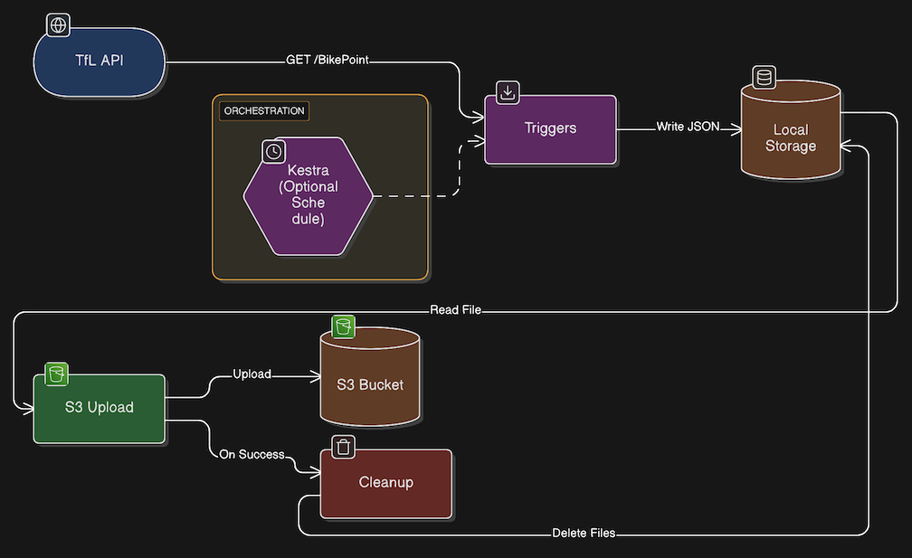

# REST API to S3 ETL Pipeline

Exemplary automated ETL (Extract, Transform, Load) pattern, fetching from an API endpoint and pushing to an S3 bucket. Out of the box it is configured for the free London bike point data endpoint (TfL API). Use it to fetch from another API by changing the url value in [main.py](main.py). The fetching comes with logs, error handling and retry logic.



### Data Flow

```
TfL API → Fetch → Local Storage → S3 Upload → Local Cleanup
```
1. **Extract**: Fetch bike point data from TfL's public API
2. **Transform**: Parse JSON response and add timestamp
3. **Load**: Write to local JSON file → Upload to S3 → Delete local file

### Repo Structure

```
bikepoint_api/
├── main.py                    # Main orchestration script
├── utils.py                   # Core utility functions
├── logging_config.py          # Logging setup
├── requirements.txt           # Python dependencies
├── kestra_orchestration.yml   # Kestra workflow definition
├── .env_template              # Environment variables template
├── data/                      # Temp local storage (auto-cleaned)
└── logs/                      # Log files with timestamps
```


## Setup

### Prerequisites
- Python 3.12+
- AWS account with S3 bucket and IAM user with `s3:PutObject` permissions

### Installation

```bash
pip install -r requirements.txt
cp .env_template .env
```

Edit `.env` with your AWS credentials:
```bash
AWS_USER_ACCESS_KEY=your_access_key
AWS_USER_SECRET_ACCESS_KEY=your_secret_key
BUCKET=your-bucket-name
```

## Usage

```bash
python main.py
```

Data is fetched from TfL, saved locally to `data/`, uploaded to S3, then deleted locally.

## Kestra Orchestration

### Setting Up Kestra
If you don't have Kestra running yet, the quickest way is via Docker:

```bash
docker run --pull=always --rm -it -p 8080:8080 kestra/kestra:latest server local
```

Access the UI at `http://localhost:8080`. For production setups, see [Kestra's Docker deployment guide](https://kestra.io/docs/installation/docker).

### Running the Pipeline

To run this pipeline on a schedule using Kestra:

### 1. Prepare Secrets
Base64 encode your credentials:
```bash
echo -n "your-value" | base64
```

### 2. Configure Kestra Secrets
In Kestra UI, create these secrets (base64 encoded):
- `SECRET_GITHUB_USER` - GitHub username
- `SECRET_GITHUB_PAT` - GitHub Personal Access Token (repo scope)
- `SECRET_AWS_USER_ACCESS_KEY` - AWS access key
- `SECRET_AWS_USER_SECRET_ACCESS_KEY` - AWS secret key
- `SECRET_BUCKET` - S3 bucket name

### 3. Deploy Workflow
1. Import [kestra_orchestration.yml](kestra_orchestration.yml) to Kestra UI
2. Update namespace to match your organization
3. (Optional) Add schedule trigger:
```yaml
triggers:
  - id: schedule
    type: io.kestra.plugin.core.trigger.Schedule
    cron: "0 */6 * * *"  # Every 6 hours
```
4. Execute manually or wait for schedule
